# Analysis

In this document, we present various types of analysis for the line fitting dynamic programming algorithm.

## Running time analysis

Below we consider various cases of running time analysis. The algorithm implemented is a case of a 2-D dynamic programming problem.
Hence for every combination of points in the segment, the sum of square of errors is calculated in `O(n)`. Hence, the overall complexity of
the algorithm is `O( n^2 * n )`, which is, `O(n^3)`

### Running time w.r.t number of points

The algorithms takes `O(n^3)` time to run, where n is the number of points. This is illustrated by the plot shown below.

| num_points | time_taken(s) |
| ---------- | ------------- |
| 100        | 0.002346      |
| 150        | 0.009063      |
| 200        | 0.01767       |
| 250        | 0.03286       |
| 300        | 0.05361       |
| 350        | 0.08288       |
| 400        | 0.1237        |
| 450        | 0.1593        |
| 500        | 0.2139        |
| 550        | 0.2818        |
| 600        | 0.3622        |
| 650        | 0.4774        |
| 700        | 0.5712        |
| 750        | 0.7016        |
| 800        | 0.8569        |
| 850        | 1.029         |
| 900        | 1.21          |

### Running time w.r.t penalty per segment

The running time of the algorithm is independent of the value of penalty per segment ( called `c`), as illustrated by the plot below:

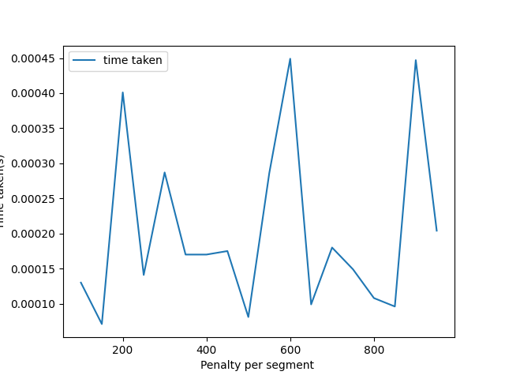

## Penalty vs Segments analysis:

The final cost for a given combination of given points does'nt depend on the value of c , i.e. , penalty per segment. Rather, it depends on  the spread of the points
in the cartesian plane. This is evident from the plot shown below.

| penalty | num_segments |
| ------- | ------------ |
| 0       | 500          |
| 100     | 428          |
| 200     | 399          |
| 300     | 383          |
| 400     | 365          |
| 500     | 346          |
| 600     | 337          |
| 700     | 320          |
| 800     | 308          |
| 900     | 303          |

## Memory usage analysis:

We have optimized the algorithm to use lesser memory.  
Formally, the algorithm requires that you store all the errors for every iteration
but we don't do that

As evident from the plot below, the memory required by the algorithm is linear w.r.t. the number of points.

| num_points | memory_allocated(bytes) |
| ---------- | ----------------------- |
| 1          | 81675                   |
| 51         | 88975                   |
| 101        | 96275                   |
| 151        | 104087                  |
| 201        | 111387                  |
| 251        | 118687                  |
| 301        | 126499                  |
| 351        | 133799                  |
| 401        | 141611                  |
| 451        | 148911                  |

# Visiualization

Below we show the visualization of the algorithm for various test-cases.

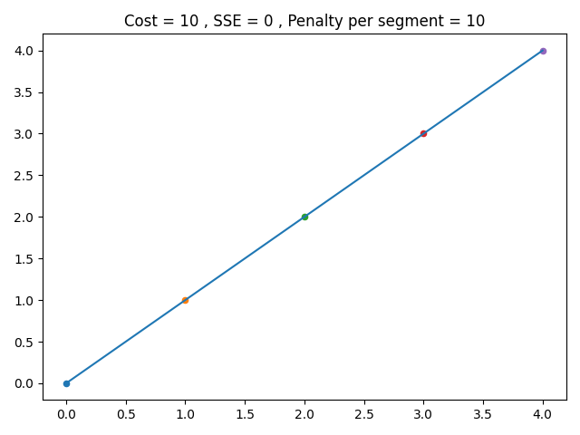

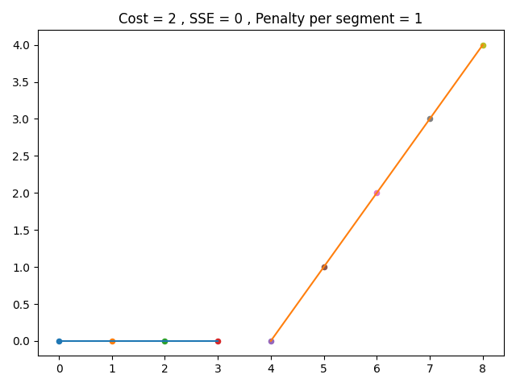

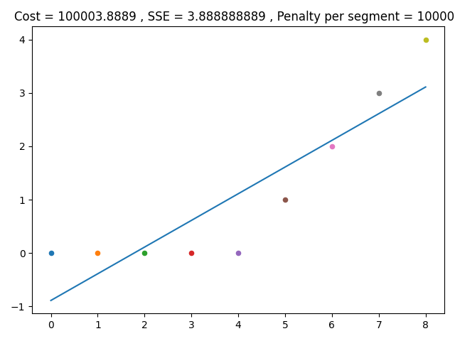

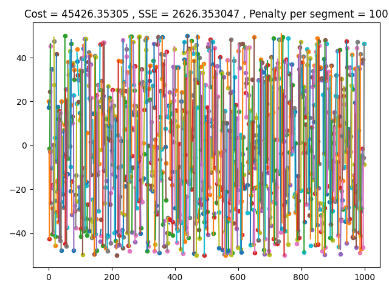

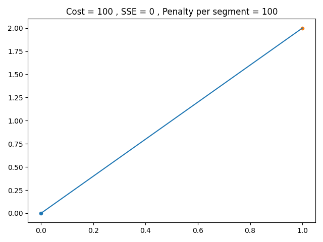

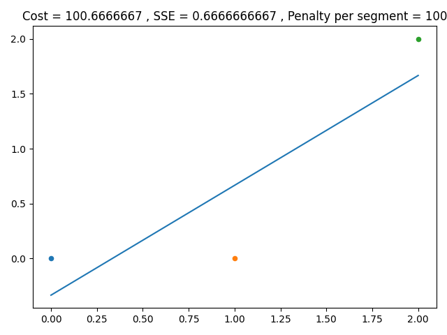

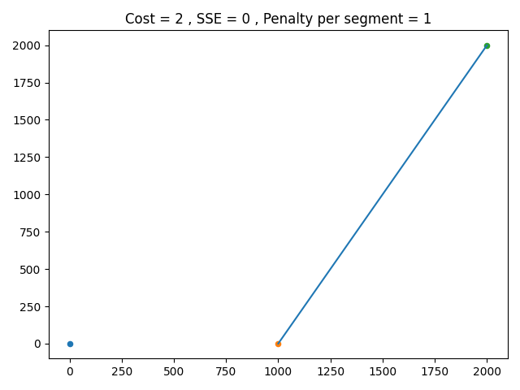

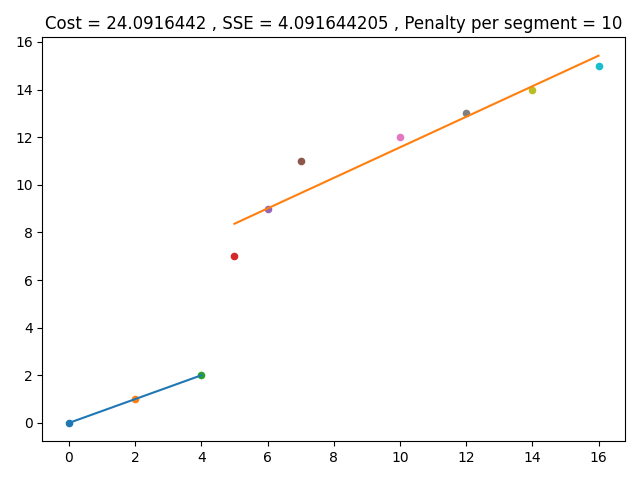

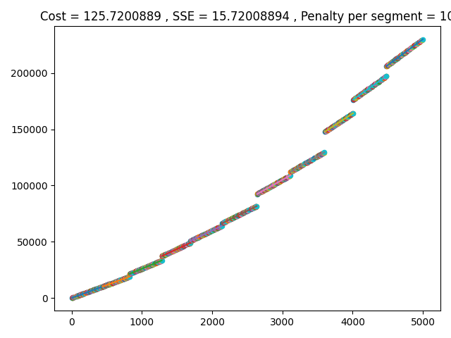

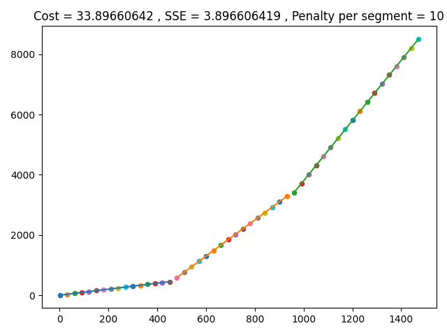

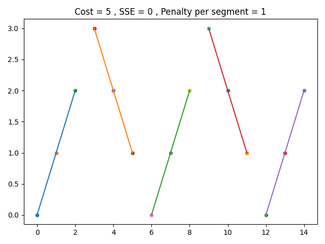

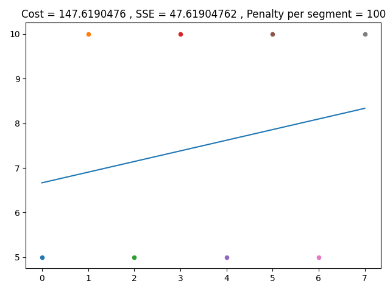

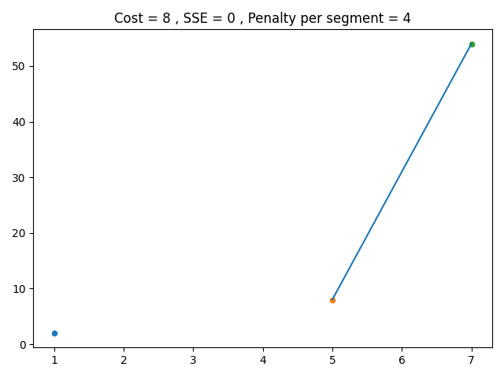

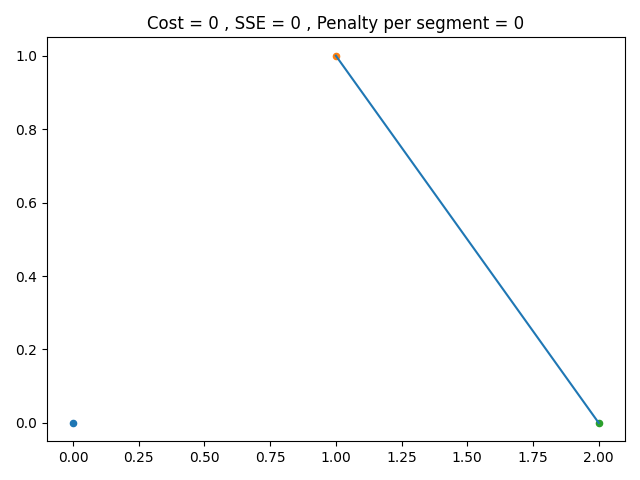
