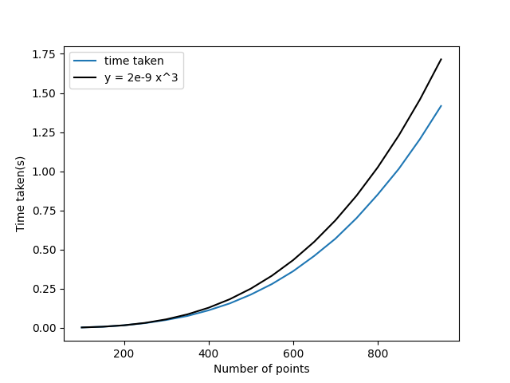
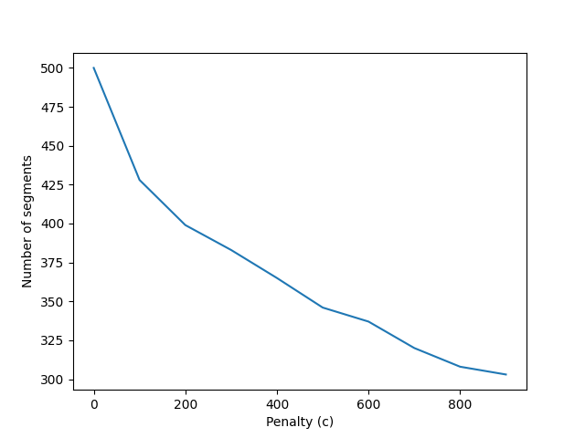
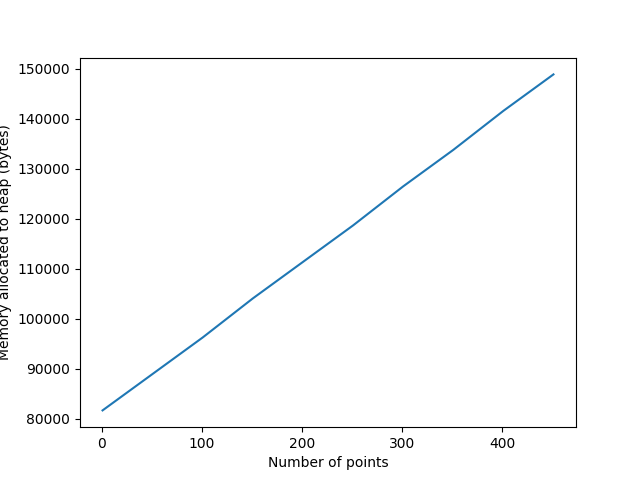

# Analysis

Lorem ipsum dolor sit amet, consectetur adipiscing elit. Donec at enim malesuada, molestie purus ac, dapibus lorem. Donec nulla metus, posuere eget odio a, suscipit vehicula arcu. Cras felis libero, rhoncus eget vulputate quis, molestie feugiat leo. Quisque sed massa ullamcorper, scelerisque magna nec, iaculis libero. Nulla eu turpis ut quam accumsan iaculis ac quis nisi. Curabitur vehicula libero vel molestie pulvinar.

Lorem ipsum dolor sit amet, consectetur adipiscing elit. Vestibulum neque felis, venenatis ornare ipsum in, porta fringilla ligula. Integer sed erat non libero lacinia pretium. Cras luctus augue ut porttitor vestibulum.

| num_points | time_taken(s) |
| ---------- | ------------- |
| 100        | 0.002346      |
| 150        | 0.009063      |
| 200        | 0.01767       |
| 250        | 0.03286       |
| 300        | 0.05361       |
| 350        | 0.08288       |
| 400        | 0.1237        |
| 450        | 0.1593        |
| 500        | 0.2139        |
| 550        | 0.2818        |
| 600        | 0.3622        |
| 650        | 0.4774        |
| 700        | 0.5712        |
| 750        | 0.7016        |
| 800        | 0.8569        |
| 850        | 1.029         |
| 900        | 1.21          |

## Penalty vs Segments analysis:

Quisque sed massa ullamcorper, scelerisque magna nec, iaculis libero. Nulla eu turpis ut quam accumsan iaculis ac quis nisi. Curabitur vehicula libero vel molestie pulvinar.

| penalty | num_segments |
| ------- | ------------ |
| 0       | 500          |
| 100     | 428          |
| 200     | 399          |
| 300     | 383          |
| 400     | 365          |
| 500     | 346          |
| 600     | 337          |
| 700     | 320          |
| 800     | 308          |
| 900     | 303          |

## Memory usage analysis:

We have optimized the algorithm to use lesser memory.  
Formally, the algorithm requires that you store all the errors for every iteration
but we don't do that

Quisque sed massa ullamcorper, scelerisque magna nec, iaculis libero. Nulla eu turpis ut quam accumsan iaculis ac quis nisi. Curabitur vehicula libero vel molestie pulvinar.

| num_points | memory_allocated(bytes) |
| ---------- | ----------------------- |
| 1          | 81675                   |
| 51         | 88975                   |
| 101        | 96275                   |
| 151        | 104087                  |
| 201        | 111387                  |
| 251        | 118687                  |
| 301        | 126499                  |
| 351        | 133799                  |
| 401        | 141611                  |
| 451        | 148911                  |
